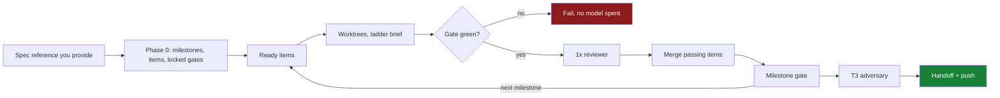

# skills

Agent skills for running software work as a **factory** rather than a conversation — plus `vskills`, a zero-dependency installer that puts them on your machine.

A skill is a file an agent loads on demand that says *how to do one job properly*. This repo holds **two autonomous delivery pipelines** — `/ship` and `/goal` — the council and worktree machinery they compose, a preserved legacy four-stage workflow, and standalone skills for the jobs around them.

```
npx vskills init
```

Same command on macOS, Linux, and Windows PowerShell.

---

## Why not just prompt?

You already can prompt an agent to "build this feature and test it." It usually works. The failures are the problem — and they are the *same* failures every time.

| What goes wrong when you prompt | Why it happens | What a skill does instead |
|---|---|---|
| Agent says "done", the tests were never run | "Done" is a feeling, judged by the same model that wants to be finished | Done is a **locked command that must exit 0**, run *after* the final edit |
| Agent reviews its own code and approves it | The misreading that produced the bug produces a confident review of the bug | The reviewer is a **different model in a different context**, and never reads the author's rationale |
| A ticket bounces between build and fix forever | Nobody is allowed to say "this ticket is unbuildable" | Three failed reviews **escalate to a human** instead of looping |
| Second session has no idea what the first did | Chat history is not a handoff | Resume from **backlog + handoff + producer digests + git**, never chat |
| Parallel agents overwrite each other | They share one checkout | One item gets one **branch + worktree**, so edits cannot collide by construction |
| "I fixed the edge cases" (it did not) | Happy path is green, so the suite says yes | Per-item review plus milestone and whole-diff gates attack the claim |
| Agent over-builds: a factory for one call site | Nothing in the prompt rewards restraint | Contributors work a **decision ladder** — delete, reuse, stdlib, native, one line — before writing anything new |

The thread running through all of it: **a claim is not evidence.** Nearly every rule in this repo exists to convert some claim into something checkable.

<details>
<summary><b>The single most important idea, if you read nothing else</b></summary>

<br>

**Maker ≠ checker, structurally.**

Not "the agent should double-check its work" — that fails, because the same context that made the mistake evaluates the mistake. Instead:

- The fixed **GLM contributor** builds in an isolated worktree and cannot judge its own code.
- Different-model **council members** review each item before merge — one under `/ship`, two under `/goal`.
- A rotating milestone reviewer checks integration only, and a read-only adversary tears down the final cumulative diff before completion.

Everything else is plumbing around that one property.

</details>

---

## Two pipelines: `/ship` or `/goal`

Both take a plan and drive it to verified, pushed completion. Both use isolated
worktrees, locked verification commands, maker ≠ checker, a resumable backlog,
and a mandatory final adversary. **Both produce production-grade code.**

They differ in how much independent scrutiny each item receives — and that
scrutiny is bought with tokens and wall-clock.

| | `/ship` | `/goal` |
|---|---|---|
| **Buys you** | Production code, fast and cheap | Production code with the widest defect net |
| **Research** | Inline lookup; recommends `/council` when genuinely contested | Full council — 8 perspectives, up to 3 debate rounds, vote |
| **Backlog sanity** | — | Phase B: two members audit the backlog |
| **Per-item review** | 1 reviewer, and only if the gate is already green | 2 independent reviewers |
| **Milestone gate** | Mechanical checks, then 1 rotating reviewer | Mechanical checks, then 1 rotating reviewer |
| **Pre-final sweep** | — | T2 success-criteria sweep |
| **Final gate** | T3 adversary on the cumulative diff | T3 adversary on the cumulative diff |
| **Build brief** | Decision ladder — YAGNI, stdlib, native, one line | Anti-over-engineering guard |
| **Tests** | One minimal runnable check per piece of non-trivial logic | Test-first throughout |
| **Human stops** | Plan approval, then runs to T3 | Plan approval, then a stop at **every** milestone |
| **Batch** | 4 items, cap 8 | 3 items, cap 4 |
| **Agents** (12 items, 3 milestones, 2 research) | **≈28** | **≈90** |

### Which one

**Reach for `/goal`** when being wrong is expensive and you want every net in the
water: auth boundaries, payments, migrations, anything touching customer data,
anything you cannot easily roll back. The extra reviewers, the debate rounds, and
the milestone stops exist precisely so a defect meets several independent
contexts before it reaches you. It is theoretically stronger, and it costs
roughly **3× the agents and considerably more wall-clock**.

**Reach for `/ship`** for everything else — features, refactors, internal tools,
anything where a locked gate plus one independent reviewer plus a final adversary
is proportionate scrutiny. It is not a "draft mode": the same gates that make
`/goal` trustworthy are present, just fewer of them, and the decision ladder
tends to produce a smaller diff to be wrong about in the first place.

The honest summary: **`/goal` catches more, `/ship` costs less, and neither ships
unverified code.** If you cannot decide, the tiebreaker is blast radius — not how
important the feature feels.

### `/ship`



`/ship <spec>` takes a spec reference you provide — an issue number, URL, or file
path. It does not require a generated `docs/agents/issue-tracker.md` file. On a
clean T3, it handles handoff and push itself.

**Gate-first review** is where most of the saving comes from: the locked
verification command runs *before* a reviewer is spawned. A red gate is a failure
on its own — there is nothing for a model to add, so none is spent.

### `/goal`


---

## The machinery

`/ship <spec>` and `/goal <plan>` each start one long-lived, resumable primary.
Whichever you run is the only writer of its `backlog.jsonl` and the only process
that merges branches or mirrors state to issue labels.

| Mechanism | Owns | Used by |
|---|---|---|
| `ship` | Phase R resume, milestones, backlog, derived gates, milestone gate, T3, delivery | `/ship` |
| `ship-parallel` | Up to 4 items in isolated worktrees, ladder brief, gate-first single-reviewer T0 | `/ship` |
| `goals` | Phase R resume, 3-7 thematic milestones, backlog, checkpoints, T1/T2/T3 | `/goal` |
| `parallel` | Up to three ready code items in isolated worktrees, fixed GLM contributor, 2× T0, merge/results contract | `/goal` |
| `council` | Independent research, evidence debate, Phase B sanity, T0/T1 reviews | `/goal`, or by hand |
| `council-adversary` | Read-only optional T0/T2 teardown and mandatory T3 whole-diff verdict | both |

`ship` and `goals` share one backlog format and one `state.mjs` contract, so a
backlog written by either is readable by both.

### Resume is state, not memory

Every fresh `/ship` or `/goal` session runs Phase R first. `backlog.jsonl` means
resume, never reparse. It acquires `lock.d`, reads the slim handoff, reconciles
stale work from `results.json`, item digests, and branch ancestry, recomputes
ready, and continues. Raw model logs never enter orchestrator context.

### Handoff is not delivery

Compacting a session into a handoff artifact and delivering it are separate
operations. Each pipeline owns its durable resume cursor —
`CONTEXT/goals/<slug>/handoff.md` or `CONTEXT/ship/<slug>/handoff.md`.
`/push-handoff` is the explicit delivery operation: it verifies, commits,
pushes, and proves the fetched remote SHA. Producing a handoff never authorizes
or implies a push.

`/ship` is the one caller that pushes without a second prompt, and only on a
clean T3 — invoking it *is* the authority `push-handoff` Step 0 requires. A T3
`BLOCK` writes the handoff and pushes nothing.

### Council is independent

The configured council is Grok 4.5, Kimi K3, Qwen 3.8 Max, GPT-5.6 Sol, and
GLM 5.2, plus the active primary's independent pass. Round 1 gives every member the full
task verbatim in one parallel spawn. Later rounds give each member the other
reports and a neutral conflict index. Evidence resolves disagreements; a vote
is only the three-round fallback. Phase B is the one exception: exactly two
members, one round, no debate or vote.

### The worktree farm is the workhorse

Each item gets its own branch and worktree — `goals/<slug>/<id>` under `/goal`,
`ship/<slug>/<id>` under `/ship`. GLM 5.2 builds and commits there. Under
`/goal`, Grok and Kimi independently review that one diff; under `/ship`, the
locked command runs first and a single non-maker reviewer is spawned only if it
is green. No verdict means no merge either way. Green peers merge even when
another item fails, unless `STRICT_BATCH=1`. The orchestrator ingests only
compact JSON results and digests.

### The ladder

`ship-parallel` hands every contributor a decision ladder and tells it to stop at
the first rung that solves the problem: necessity (YAGNI) → codebase reuse →
standard library → native platform features → existing dependencies → one-liner →
minimal implementation. Input validation at trust boundaries, data-loss handling,
security, accessibility, and anything the acceptance criteria explicitly asked for
are never on the chopping block — lazy is not negligent.

Tests follow the same restraint: **non-trivial logic requires at least one minimal
runnable check**, trivial code gets none, and the locked verification command must
still pass. The reviewer enforces both directions — under-build is P0/P1,
over-build (a speculative abstraction, a needless dependency, tests past the rule)
is P2.

The ladder is adapted from [ponytail](https://github.com/DietrichGebert/ponytail)
(MIT). It is inlined into the worker brief rather than loaded as a plugin, because
worktree subagents may not load plugins.

### Gates get wider

Under `/goal`: T0 checks one item with two non-maker reviewers, T1 runs mechanical
integration checks then one rotating reviewer, T2 sweeps the plan's success
criteria, T3 is a mandatory read-only adversary over the cumulative merged diff.
The pipeline pauses after every passing T1 for human continuation.

Under `/ship`: the item gate is the locked command plus one reviewer, the
milestone gate is mechanical checks plus one rotating reviewer scoped to
integration only, and T3 is the same mandatory adversary. There is no milestone
stop — a passing gate rolls straight into the next milestone.

Both drain P0/P1 findings before completion, and both cap attempts at two per
source id before escalating to a human.

### Legacy workflow

The previous `/planner -> /coder -> /debugger -> /reviewer` GitHub Projects
pipeline remains available only as `/legacy-planner`, `/legacy-coder`,
`/legacy-debugger`, and `/legacy-reviewer` under `legacy-workflow/`. Its former
`adversarial-loop` mechanism is now `multi-agent-review`.

---

## Built to production standards

This is the discipline you would apply to code that pages you at 3am, applied to the process that writes it. Every claim below is checkable in this repo right now.

| Standard | How it's held |
|---|---|
| **Nothing ships unverified** | Every ticket carries a `Verification-command` that must exit 0, run *after* the final edit — not before, not "probably still passing" |
| **Independent sign-off** | The GLM maker is excluded from every review tier; the final adversary is read-only |
| **Non-functionals are contracts** | Acceptance and invariant docs travel into every item, milestone gate, and final teardown |
| **Failures terminate** | Attempts are capped at two per source id; blockers escalate instead of creating recursive retries |
| **State is auditable** | Backlog, handoff, producer digests, branch ancestry, and structured review records reconstruct the run without chat |
| **Concurrency is bounded** | `MAX_BATCH` defaults to 3/caps at 4 under `/goal`, 4/caps at 8 under `/ship`; every item gets a separate branch and worktree |
| **Restraint is reviewable** | Over-build is a reportable finding, not a matter of taste — the reviewer flags speculative abstractions and needless dependencies with `file:line` |
| **Deploys are proven** | `push-handoff` refuses to claim success without reading the remote SHA back, never force-pushes, and scans the diff for secrets |

The tooling holds the same bar. `vskills` ships **zero runtime dependencies** with tests covering install, drift detection, dependency resolution, symlink safety, and the npx entrypoint. Copies stage into a temp dir and swap in via `rename`, so an interrupted install cannot leave a half-written skill. Content is hashed, so a skill you hand-edited is detected as drifted and left alone rather than silently overwritten. Destructive overwrites are backed up first. The guarantees are written down and held to in [`docs/invariants.md`](docs/invariants.md).

<details>
<summary><b>What each mechanism buys, and what it costs</b></summary>

<br>

No mechanism here is free. Each row is the honest trade.

| Mechanism | Failure it removes | Costs you |
|---|---|---|
| Locked `Verification-command` run after the final edit | "Done" claimed on tests that were never run | Nothing — this one is strictly free |
| Gate-first review (`/ship`) | Paying a reviewer to read code the tests already rejected | Nothing — also strictly free |
| Blind review on a different model | Self-approved bugs. The single largest win. | A second model's tokens |
| Invariants locked *before* the spec | Plans optimized for "finish" instead of "safe" | One interactive planning session |
| Widening review tiers | Local and composed defects missed by one scope | Several fresh-model passes — the main cost difference between `/ship` and `/goal` |
| The decision ladder | Factories for one call site; dependencies the stdlib already covers | Occasionally a rung too low, caught at review |
| Attempt cap → human escalation | Infinite build/fix loops on impossible items | An occasional human interrupt |
| Atomic backlog + producer digests | Session two re-deriving session one | Checkpoint discipline |
| One worktree per item | Agents silently overwriting each other | Worktree lifecycle overhead |

Overall you are trading **tokens and time-to-first-"done"** for **defects that never reach you**. That trade is excellent on a payments integration or an auth boundary, and poor on a script you are deleting tomorrow. Choosing `/ship` over `/goal` is that same dial, set one notch cheaper.

**If you adopt one thing:** lock a verification command before the work starts and require it to be run after the final edit. Most false "done" claims disappear and it costs nothing.

**If you adopt two:** have a *different model* review the diff without reading the author's explanation.

</details>

<details>
<summary><b>When NOT to use this</b></summary>

<br>

Knowing where a tool stops is part of what makes it trustworthy inside its range.

- **Throwaway scripts, spikes, prototypes.** The pipeline's overhead buys nothing when the code is going in the bin.
- **One-line fixes.** A multi-tier goal run for a typo is theater.
- **Exploratory work where you don't know the question yet.** Map the question before driving a plan through it; fog produces confident nonsense.
- **Solo hacking where you *are* the checker and you're actually going to read it.** The pipeline's value is proportional to how little you plan to read.
- **No test suite at all.** The gate is the backbone. Without one, every "done" is a judgment call again and most of the machinery is inert.

Within its range, the remaining question is only *which* pipeline. `/goal`'s extra
tiers are worth their cost where a defect is expensive to discover late; `/ship`
is the right default everywhere else. Reaching for `/goal` on low-blast-radius
work is the same category of mistake as reaching for either on a throwaway script
— overhead bought for nothing.

</details>

---

## "I want to…" — start here

| I want to… | Use |
|---|---|
| **Build a spec to pushed, verified code** | `/ship <spec>` |
| Same, but with every review net in the water | `/goal <plan>` |
| Drive an existing plan doc through milestones | `/goal CONTEXT/architecture.md` |
| Run `/goal` from a live Herdr pane farm | `/herdr-orchestrator` |
| Research a genuinely contested decision | `council` |
| Build several ready items safely | `ship-parallel` through `ship`, or `parallel` through `goals` |
| Tear down a converged diff without fixing it | `council-adversary` |
| Run a blind loop against a real quality bar | `/gauntlet-loop` |
| Run *any* task until a checker says done | `/loop-engineer` |
| Have several models attempt + cross-examine the same task | `/multi-agent-review` |
| Audit a whole codebase, not one diff | `/codebase-audit` |
| Check an invariant is *enforced*, not just documented | `/invariant-evidence-review` |
| Work on several tickets at once | `/parallel-subagent-implementation` |
| Deliver a whole ticket range in order | `/subagent-batch-implementation` |
| Ship a webhook / queue / billing integration | `/provider-integration-tdd` |
| Price a feature whose cost is inference | `/ai-subscription-unit-economics` |
| Unstick a pipeline reporting false progress | `/state-driven-pipeline-recovery` |
| Hand off to the next session | `/push-handoff` |

---

## Full catalog

<details>
<summary><b>Pipeline machinery</b> — how tickets move and what counts as proof</summary>

<br>

`ship` and `goals` are the two active chains. `ship-parallel`, `council`, `parallel`, and `council-adversary` are the machinery they compose; `pipeline/` contains additional reusable delivery disciplines.

| Skill | Use when |
|---|---|
| `ship` | Lean resumable driver — spec to pushed code, gate-first review, runs to T3 unattended |
| `ship-parallel` | Worktree build farm with the decision ladder, gate-first single-reviewer T0 |
| `goals` | Widest-net resumable plan driver, sole backlog writer, milestone stops |
| `council` | Independent research/debate and scoped T0/T1 review protocol |
| `parallel` | Worktree build farm, two-reviewer T0 gate, partial-success integration |
| `council-adversary` | Read-only optional T0/T2 and mandatory T3 teardown |
| `github-projects-pipeline` | Legacy/reusable GitHub Projects stage protocol |
| `profile-gated-delivery` | Run an effort end to end with an evidence gate between every stage |
| `specialist-profiles` | Build and verify the four role agents so maker ≠ checker is structural, not aspirational |
| `state-driven-pipeline-recovery` | The pipeline is thrashing, or a worker reports success while nothing changed |
| `controlled-ticket-delivery` | Budget caps, live migrations, restricted git or tracker access |
| `ticket-implementation-tdd` | Detailed one-ticket TDD discipline for standalone or legacy workflows |
| `provider-integration-tdd` | Queues, signed webhooks, idempotent billing, owned artifacts — where failures are replay and ordering, not logic |
| `invariant-evidence-review` | Is this invariant actually enforced and measured, or just asserted in a comment? |
| `codebase-audit` | Audit a whole system: sweep by layer, rank by blast radius, emit tickets |
| `shared-worktree-safety` | Another agent or human is writing to the same checkout |
| `shared-worktree-delegation` | Fanning subagents into one tree with explicit file lanes |
| `parallel-subagent-implementation` | **Start here for any fan-out** — carries the route table for all parallel work |
| `subagent-batch-implementation` | An authorized ticket *range* delivered in dependency waves |
| `ai-subscription-unit-economics` | Pricing and usage caps when inference is your cost of goods |

The load-bearing rule across all of them: **done is a locked verification command that was actually run after the final change**, plus an independent checker for non-trivial work, plus truthful tracker state.

</details>

<details>
<summary><b>Standalone skills</b> — useful with or without the pipeline</summary>

<br>

| Skill | What it's for |
|---|---|
| `loop-engineer` | Wrap any task in a closed maker→checker loop with an explicit done-condition |
| `gauntlet-loop` | Generate or run a blind maker→critic loop against a real quality bar for one-shot, UI, writing, and implementation work |
| `herdr-orchestrator` | Live Herdr layout plus Grok/Codex/Council orchestration for a `/goal` run |
| `multi-agent-review` | Same task, several model/provider agents in isolated worktrees, relayed cross-critique, final artifacts rated side by side |
| `push-handoff` | Commit and push under explicit authority, and **prove** it by reading the remote SHA back |
| `setup-obsidian` | Turn a docs folder into a retrieval graph — router, generated indexes, state file |
| `setup-vskills` | Set this repo up on a new machine |

`/gauntlet-loop` is the lightweight path for work that does not need the full
planner → coder → debugger → reviewer pipeline. Use it for one-shot prompts, UI
polish, writing, research, or small implementation tasks:

```text
/gauntlet-loop build a landing page for my running brand
```

It first requires a named, fetchable comparison bar. In prompt mode it returns a
paste-ready prompt; in run mode it loops a maker and a fresh critic until the output
wins the blind comparison and its normal verification gate passes. UI work also gets
same-viewport screenshots, responsive states, accessibility, typography, and
interaction checks. It never replaces the debugger or reviewer for security,
permissions, payments, migrations, or other high-risk work.

Install only this skill with:

```bash
npx vskills add gauntlet-loop
```

`/herdr-orchestrator` is the path when you already work in [Herdr](https://herdr.dev)
and want a Grok pane to run `/goal` across live terminals instead of inside one
OpenCode session. It is useful when Codex should implement, three non-OpenCode
Council agents should plan and review independently, and the run must pause at
every milestone until you type `continue`. It asks which panes and models to
use, builds a Main tab plus a Council Agents tab, then peeks Codex against
durable `goals` state rather than trusting chat.

It is the wrong tool outside Herdr, for a single-agent task, for native
OpenCode `/goal` without a pane farm, or whenever you want an OpenCode agent on
Council — that target is excluded.

```text
/herdr-orchestrator
```

`vskills add herdr-orchestrator` also installs `goals`, `council`, and
`parallel`.

</details>

## Installing with `vskills`

**macOS / Linux** (bash, zsh):

```bash
npx vskills init               # install every skill
npx vskills list               # what's installed / drifted
npx vskills add <skill>        # one skill + its dependencies
npx vskills update [skill...]  # refresh (skips your local edits)
```

**Windows** (PowerShell) — the same commands, but replace placeholders such as `<skill>` with a real name; PowerShell reserves `<` and `>` so those angle-bracket placeholders must not be typed literally.

```powershell
npx vskills init               # install every skill
npx vskills list               # what's installed / drifted
npx vskills add gauntlet-loop  # one skill + its dependencies
npx vskills update ship        # refresh (skips your local edits)
```

Content is copied to the install root and linked into each agent's skills directory:

| | install root | Claude Code target |
|---|---|---|
| macOS / Linux | `~/.agents/skills/<name>` | `~/.claude/skills/<name>` |
| Windows | `%USERPROFILE%\.agents\skills\<name>` | `%USERPROFILE%\.claude\skills\<name>` |

On Windows, vskills explicitly requests a directory junction for each target. Junctions need neither Developer Mode nor an elevated shell.

<details>
<summary><b>If npm 12 blocks a GitHub package spec (<code>EALLOWGIT</code>/<code>EALLOWREMOTE</code>)</b></summary>

<br>

When installing from GitHub, npm 12 defaults both `allow-git` and `allow-remote` to `'none'`. That means a GitHub package spec can fail with `EALLOWGIT`, and a GitHub archive tarball URL can fail with `EALLOWREMOTE`.

```
npm error code EALLOWGIT
npm error Fetching packages of type "git" have been disabled
```

An archive URL can be rejected similarly:

```
npm error code EALLOWREMOTE
```

Use the git allowance escape hatch if you control npm's command-line options:

```bash
npx --allow-git=all github:vraj-ai/skills init
```

Or clone and run the CLI directly, with no npm involvement:

```bash
git clone https://github.com/vraj-ai/skills.git
cd skills
node bin/vskills.js init
```

On Windows PowerShell, use `node bin\vskills.js init` for the final line.

</details>

<details>
<summary><b>What it guarantees</b></summary>

<br>

- **Your edits are safe by default.** If an installed skill's content hash doesn't match the manifest, it's `drifted` and left untouched. Only `--force` overwrites it.
- **Destructive overwrites get backed up first**, to `~/.agents/skills/.vskills-backup/<name>-<timestamp>`.
- **Interrupted copies never corrupt.** Staged in a temp dir, swapped in with `rename`.
- **Symlinks are never clobbered.** A real directory or a foreign symlink at the target path is left alone with a warning.

Zero runtime dependencies, Node ≥18. Full design in [`docs/spec-vskills-cli.md`](docs/spec-vskills-cli.md); the guarantees it holds itself to are in [`docs/invariants.md`](docs/invariants.md).

</details>

---

## Layout

```
bin/vskills.js    the vskills CLI entrypoint
src/              vskills implementation
test/             vskills test suite (node --test)

ship/             lean spec-to-pushed driver, shared backlog contract, T3 + delivery
ship-parallel/    worktree build farm with the decision ladder + gate-first review
goals/            widest-net plan driver, atomic backlog, milestone gates
council/          independent research, debate, T0/T1 review protocol
parallel/         worktree build farm + CLI runner + compact results contract
council-adversary/read-only T0/T2/T3 teardown
opencode/         canonical global primary/subagent + /goal definitions
legacy-workflow/  preserved legacy-planner/coder/debugger/reviewer skills

push-handoff/     verified, explicitly authorized commit/push closeout
loop-engineer/    closed maker→checker loop runner
gauntlet-loop/    blind maker→critic loop for one-shot and UI work
herdr-orchestrator/ Herdr pane farm for Grok + Codex + 3 Council on a /goal run
multi-agent-review/ standalone multi-model worktree comparison loop
pipeline/         the machinery: stage protocol, roles, worktree safety,
                  batch delivery, audit, recovery
```

<details>
<summary><b>Global OpenCode agent profile</b></summary>

<br>

OpenCode loads the canonical definitions under `opencode/agent/` globally from
`~/.config/opencode/agent/`. Shift-Tab can select either `goals` for delivery or
`council` for standalone research/review. Whichever orchestrator is running
remains the only writer and merger for its run. `ship` draws from the same
roster — the fixed contributor plus one non-maker reviewer plus the adversary.
Every child is `mode: subagent` with `task: deny`, so the tree is always one
level:

```text
ship    -> {contributor, one council reviewer, council-adversary}
goals   -> {contributor, council members, council-adversary}
council -> {council members, council-adversary}
```

| Agent | Model |
|---|---|
| `goals` | current selected model, delivery primary |
| `council` | current selected model, read-only primary |
| `contributor` | `opencode-go/glm-5.2` |
| `council-grok` | `opencode-go/grok-4.5` |
| `council-kimi` | `openrouter/moonshotai/kimi-k3` |
| `council-qwen` | `openrouter/qwen/qwen3.8-max` |
| `council-sol` | `openai/gpt-5.6-sol` |
| `council-gemini` | `openrouter/google/gemini-3.6-flash` |
| `council-deepseek` | `openrouter/deepseek/deepseek-v4-flash-0731` |
| `council-glm` | `opencode-go/glm-5.2` (research only for GLM-authored code) |
| `council-adversary` | `opencode-go/grok-4.5`, read-only |

Members have read-only filesystem, web, skill, and inherited MCP access. They
inspect source material themselves instead of receiving a
pre-solved answer. The CLI path launches fresh `opencode run --dir <worktree>`
processes; if no binary exists, the orchestrator uses parallel Task calls against
the same worktrees and emits the same result contract.

OpenCode loads configuration once. Quit and restart it after changing an agent,
skill, command, or config file.

</details>
